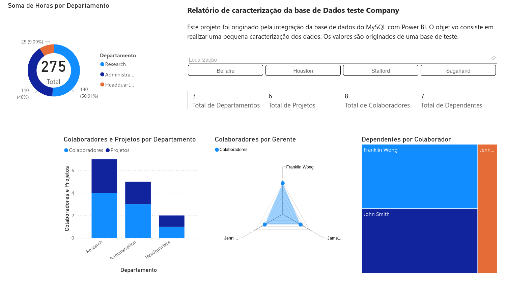

# Desafio Processando e Transformando Dados com Power BI - Desafio de projeto DIO

### Relatório desenvolvido para o segundo Desafio de Projeto referente ao módulo "Visualização e Análise de Dados com Power BI" da [DIO](https://www.dio.me/). O desafio visa a coleta, obtenção e transformação de dados com Power BI e MySQL.

### Amostra

## Itens trabalhados

- Cabeçalhos ajustados e tabelas sem uso excluídas
- Tipos de dados verificados e ajustados
- Verificação da presença campos de nulos. Foram corrigidos conforme a necessidade
- Não foram encontrados departamentos sem gerentes
- A coluna Endereço foi dividida para melhor aproveitamento
- Mesclagem da tabela employee com departament
- Remoção de colunas desnecessárias da última mesclagem
- Mesclagem dos colaboradores com seus gerentes
- Mesclagem de localização dos departamentos com departamentos, gerando nomes únicos através da combinação dos dois
- Agrupamento de gerentes, a fim de saber quantos colaboradores existem por gerente
- Remoção de colunas desnecessárias

## Questão: Por que foi escolhido a mesclagem e não a atribuição?

#### A mesclagem é preferível nesse caso, pois estamos combinando dados que se complementam usando uma chave comum para criar uma nova tabela integrada. Já a combinação por atribuição seria mais adequada para unir dados de fontes com estruturas semelhantes, sem a necessidade de uma chave comum entre elas.

